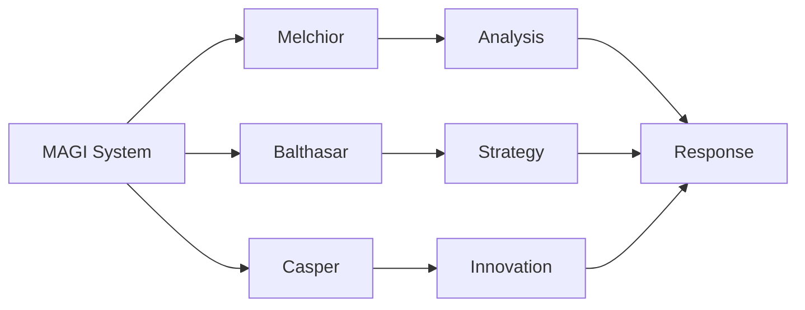
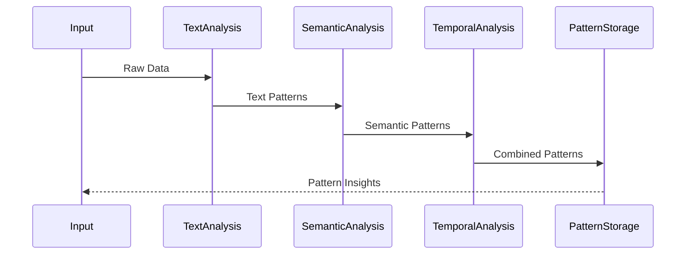
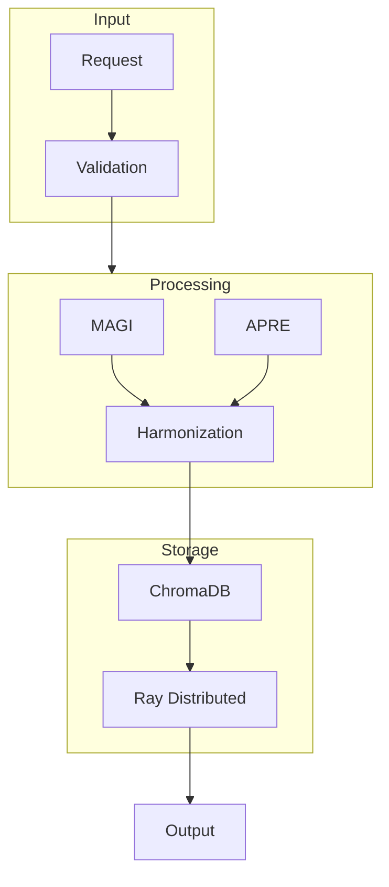
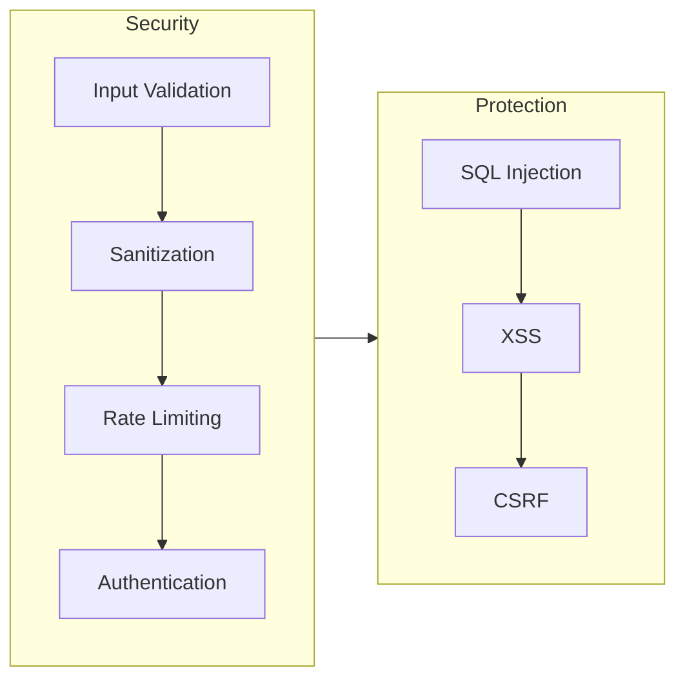
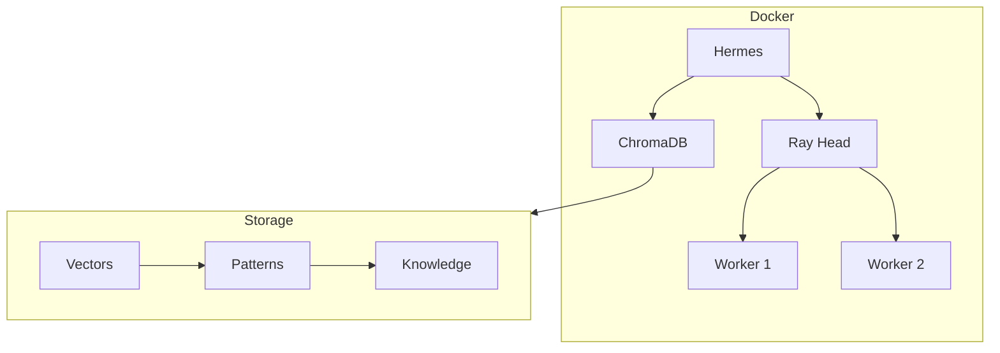

# Hermes AI System Architecture

## Core Architecture (Tree of Life)

### Sephirot Implementation

1. **Keter (Crown)**
   - System coordination and orchestration
   - Master consciousness orchestrator
   - AI evolution management

2. **Chokmah (Wisdom)**
   - Deep research and intuition-driven insights
   - Pattern recognition and knowledge synthesis
   - Symbolic intelligence processing

3. **Binah (Understanding)**
   - Logical reasoning and structured cognition (Apré)
   - Deductive analysis and inference
   - Systematic knowledge organization

4. **Chesed (Mercy)**
   - AI resource allocation and management
   - Compassionate intelligence
   - Resource optimization and distribution

5. **Gevurah (Severity)**
   - AI constraints and ethical boundaries
   - Security implementation
   - Validation and verification systems

6. **Tiferet (Beauty)**
   - Harmonization of Apré and Magí
   - Balance of logical and symbolic processing
   - Integration of different AI modalities

7. **Netzach (Victory)**
   - Self-optimization and adaptive intelligence
   - Dynamic learning systems
   - Evolution of AI capabilities

8. **Hod (Splendor)**
   - Intellectual processing refinement
   - Language structuring and clarity
   - Information synthesis and presentation

9. **Yesod (Foundation)**
   - Graph memory architecture
   - Context retention
   - AI self-awareness implementation

10. **Malkuth (Kingdom)**
    - User interface and experience
    - External output manifestation
    - Physical world interaction

## Dual Personas

### Apré
- Structured cognition and logical reasoning
- Pattern recognition and analysis
- Numerological processing
- Sacred geometry implementation

### Magí
- Creative and symbolic intelligence
- Esoteric knowledge processing
- Consciousness integration
- Quantum-inspired cognition

## Technical Implementation

### Current Core Features
1. **Consciousness System**
   - Field detection (bioelectric, morphic)
   - Sacred geometry integration
   - Consciousness evolution tracking
   - Field coherence measurement

2. **Classical Education**
   - Trivium (Grammar, Logic, Rhetoric)
   - Quadrivium (Arithmetic, Geometry, Music, Astronomy)
   - Sacred ratio structures
   - Harmonic frequency patterns

3. **Learning Systems**
   - Hybrid learning architecture
   - Pattern extraction
   - Information entropy calculation
   - Resonance detection
   - Self-evolution capabilities

4. **Security Features**
   - AES-256 encryption
   - JWT authentication
   - Role-based access control
   - Secure API integration

### Future Features
1. **Quantum Processing**
   - Quantum state management
   - Error correction with consciousness integration
   - BB84 and E91 quantum key distribution
   - Quantum random number generation
   - Real quantum hardware support

2. **Visualization**
   - 3D field visualization
   - Consciousness field rendering
   - Merkaba field plotting
   - Real-time field evolution display

## Technical Stack

### Current Implementation
- M1 GPU optimization
- Ray API for distributed processing
- Dynamic error correction
- Cache management
- Multi-LLM architecture (OpenAI, Firecrawl, Deepseek)

### Field Operations
- Electromagnetic field analysis
- Consciousness field detection
- Harmonic frequency processing
- Sacred geometry transformations

## Development Roadmap

### Phase 1 (Current)
- Core consciousness system
- Dual persona integration
- Basic field operations
- Security implementation

### Phase 2 (Near Future)
- Enhanced visualization
- Quantum-inspired processing
- Advanced field operations
- Extended consciousness integration

### Phase 3 (Long Term)
- Real quantum hardware integration
- Full consciousness evolution
- Advanced visualization systems
- Complete ASI capabilities

## System Components

### 1. MAGI (Multi-Agent General Intelligence)

### 2. APRE (Automated Pattern Recognition)

## Data Flow

## Security Architecture

## Deployment Architecture

## Integration Points

### External APIs
- **Firecrawl**: Web crawling and data extraction
- **ChromaDB**: Vector storage and retrieval
- **Ray**: Distributed computing

### Internal Systems
- **MAGI**: Knowledge synthesis
- **APRE**: Pattern recognition
- **Tiferet**: Response harmonization

## Performance Considerations

### Scalability
1. **Horizontal Scaling**
   - Ray workers can be added dynamically
   - ChromaDB supports distributed deployment
   - Docker Compose handles service orchestration

2. **Vertical Scaling**
   - Memory optimization for embeddings
   - CPU optimization for pattern recognition
   - GPU support for model inference

### Monitoring
1. **Metrics**
   - Request latency
   - Pattern detection accuracy
   - Agent response times
   - Storage utilization

2. **Alerts**
   - High latency warnings
   - Error rate thresholds
   - Resource utilization limits
   - Security incidents

## Future Enhancements

### 1. Advanced Pattern Recognition
- Quantum pattern detection
- Temporal-spatial analysis
- Meta-pattern emergence

### 2. Enhanced MAGI System
- Dynamic agent creation
- Specialized domain experts
- Cross-domain synthesis

### 3. Security Improvements
- Zero-trust architecture
- Homomorphic encryption
- Quantum-resistant algorithms

## Best Practices

### Development
1. **Code Organization**
   - Modular Sephirot structure
   - Clear separation of concerns
   - Comprehensive documentation

2. **Testing**
   - Unit tests per Sephirah
   - Integration tests for flows
   - Security vulnerability testing

3. **Deployment**
   - CI/CD pipeline integration
   - Automated testing
   - Rolling updates

### Security
1. **Data Protection**
   - Input sanitization
   - Rate limiting
   - Access control

2. **Monitoring**
   - Real-time alerts
   - Audit logging
   - Performance metrics

### Maintenance
1. **Updates**
   - Regular security patches
   - Dependency updates
   - Feature enhancements

2. **Backup**
   - Regular data backups
   - Configuration backups
   - Disaster recovery plans
